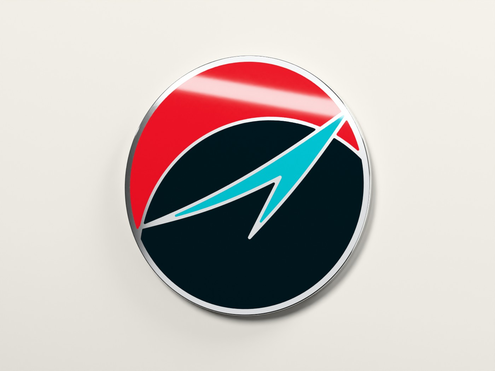
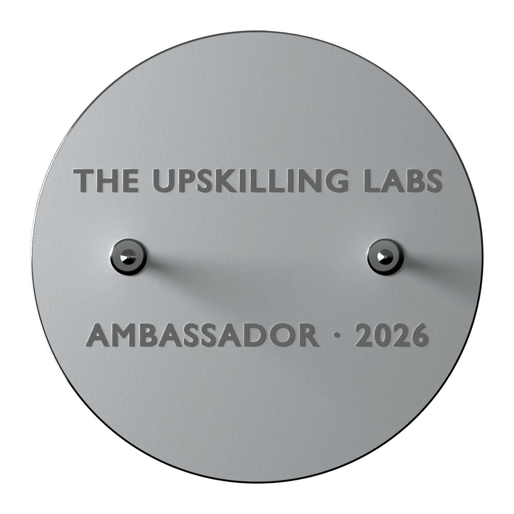

# Ambassador pin

Earned by ambassadors who apply, are accepted, and finish onboarding.

`pin-front.svg` is starter production art built from the OLOS orb by `build_pin.py`. It is 1:1 in millimetres, and every colour is a filled shape with raised metal between the colours. Send the factory this file (or a refined version of it). The 3D model in `blender/` is for mock-ups and approval only.



| Front (true colour) | Back |
| --- | --- |
|  |  |

## The spec

| | Choice | Why |
| --- | --- | --- |
| Type | **Hard enamel** | Flat, polished, and scratch-resistant, so it reads as earned. Soft enamel is cheaper but looks like merch. |
| Size | **1.25 in (31.75 mm)** round | 1.25 to 1.5 in covers most orders. At 1 in, the swoosh tail gets too thin. |
| Metal | **Polished nickel** (silver) | Bright lines outline the orb against ink. Black nickel works with hard enamel if you want it quieter. Dyed black and antique finishes are soft enamel only. |
| Colours | **3**: ink, red, and bright teal | Recommended range is 8 or fewer, and fewer holds up better. The orb's gradients become flat fields, because enamel can't do gradients. |
| Lines | 0.4 mm metal between colours, 0.8 mm rim (about 0.65 mm flat after the rounded edge) | Factory minimum is 0.2 to 0.3 mm. 0.4 mm survives polishing. `build_pin.py` fails if any metal comes out under 0.3 mm. |
| Smallest enamel cell | 0.3 mm | Smaller cells can't be filled, so the build script drops them. |
| Back | **2 posts**, 9 mm either side of centre, + locking clutches | A round pin with an arrow has an orientation. Single posts spin, and rubber clutches loosen. |
| Backstamp | THE UPSKILLING LABS · AMBASSADOR · year, raised polished text on a satin back | Keeps text off the front. Ask for sans serif at 6 pt or more (1.5 mm caps), with strokes and the gaps between letters at least 0.25 mm; thinner raised text fills in. The year makes each cohort's pin distinct. Costs about $50 once. |
| Card | Backing card: "Earned, not given." [PLACEHOLDER] | The card makes it a moment and not a freebie. |

Pantone codes in the SVG (`data-pantone`) are nearest matches: Black 6 C, 185 C, and 3125 C. Confirm them against a physical **Solid Coated** guide, not a screen. Enamel reds usually come out darker than the chip.

## Moving the orb onto the pin

- **Gradients become flat fields.** The red glow becomes a crescent cut at the gradient's midpoint, and the teal glow is dropped. The swoosh uses the bright end of its own gradient, because brand teal `#0094A0` goes muddy on ink at 1.25 in.
- **Sharp tips become metal.** Enamel can't fill a point, so the swoosh's tips end in raised metal.
- If you want the glow back, the options in order of cost are translucent teal enamel over a textured metal field, then a UV-printed insert. Both add cost and risk; flat looks cleaner at this size.

## The 3D model (Blender)

`blender/ambassador_pin.py` builds the pin at real size in the open Blender file. It is tested on 4.5 LTS, 5.0 and 5.1.

1. In Blender, open the **Scripting** tab, then **Text → Open** and pick `blender/ambassador_pin.py`.
2. Click **Run Script**, or press Alt P with the mouse over the text.
3. The pin appears in the Scripting and Layout viewports. The **Pin** empty is selected, so press R to rotate it or G to move it. Numpad 0 looks through the hero camera, and F12 renders.

Or open `blender/ambassador-pin.blend`, which the script made.

**What it builds:**
- A 1.5 mm nickel body with a rounded rim.
- Enamel set 0.3 mm into the metal and flush with it, the same art as `pin-front.svg`.
- Two posts with locking clutches, and the raised backstamp.
- A small studio: the pin on its backing card, soft lights, a hero camera, and front and back cameras that follow the pin. The lights are calibrated so the enamel renders as its brand hex values (Khronos PBR Neutral view).

**If your file already has work in it:**
- Running the script again rebuilds only its own **Ambassador Pin** collection. It keeps anything of yours inside that collection, or parented to the pin.
- It sets this scene's camera, World, units, Cycles and colour settings. Your previous World is kept with a fake user.
- Set `STUDIO = False` at the top of the script to build the pin alone.

**Renders and files for this folder:**

```sh
blender -b -P design/pin/blender/ambassador_pin.py -- --render design/pin/renders --samples 64 --size 1400
blender -b -P design/pin/blender/ambassador_pin.py -- --save design/pin/blender/ambassador-pin.blend --glb design/pin/blender/ambassador-pin.glb
```

`ambassador-pin.glb` is the pin alone, upright and facing the viewer, for web and AR viewers.

The factory still redraws from `pin-front.svg`, never from a render.

## Ordering

- Ask for a **digital proof with Pantone codes**. For the first order, also ask for a **physical pre-production sample**.
- Typical order: 50 to 100 minimum, 7 to 10 business days of production after the proof, and 3 to 5 weeks door to door.
- Order the next cohort's pins when you confirm that cohort.

## Changing the art

Edit the constants at the top of `build_pin.py` (size, line width, colours) and run:

```sh
pip install shapely && python3 design/pin/build_pin.py
```

That rewrites `pin-front.svg`, the site's `public/pin.svg`, and the art inside `blender/ambassador_pin.py`. Then run the Blender script again.

Sources: [Wizard Pins guide](https://wizardpins.com/pages/enamel-pin-guide) · [CreatePins: why a pin can't be made](https://createpins.com/blog/why-cant-my-enamel-pin-be-made/) · [CreatePins size guide](https://createpins.com/blog/enamel-pin-design-size-guide/) · [Vograce size chart](https://vograce.com/blogs/news/pin-size-chart-guide) · [Hard vs soft (Stadri)](https://www.stadriemblems.com/blog/soft-enamel-pins-vs-hard-enamel-pins/) · [Gradients (EnamelPinCustom)](https://www.enamelpincustom.com/can-enamel-pins-have-gradient-colors/) · [Pin backs (PinPros)](https://www.pinprosplus.com/post/enamel-pins-5-tips-to-keep-them-from-falling-off) · [Pantone and proofs (CreatePins)](https://createpins.com/blog/enamel-pin-colors-guide/)
